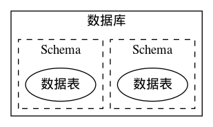

# PostgreSql 对象存储

## PostgreSql 数据库、Schema、table 的关系



数据表存储在数据库中，Schema对数据表进行逻辑分组。

## PostgreSql 创建 Schema

```sql
create schema test;
```

## 在 Schema 中创建数据表

```SQL
create table test.student(
    id serial primary key not null,
    data jsonb
);
```

## 插入数据

```SQL
insert into test.student(data) values('{"name":"skyfire", "age":26}');
```

## 查询数据

```SQL
select data->'name' from test.student where data @> '{"age":26}';
```

或者：

```SQL
select data->'name' from test.student where data->'age' = '26';
```

或者：

```SQL
select data->'name' from test.student where (data->'age')::int4 = 26;
```

## 更新数据

增加一个字段

```SQL
update test.student set data=data||'{"phone":"123456789"}'::jsonb where data @> '{"age":26}';
```

删除一个字段

```SQL
update test.student set data=data-'age' where data @> '{"name":"skyfire"}';
```

修改一个字段：

```SQL
update test.student set data=jsonb_set(data, '{name}', '"zhangsan"') where data @> '{"name":"skyfire"}';
```

## 删除数据

```SQL
delete from test.student where data @> '{"name":"zhangsan"}';
```