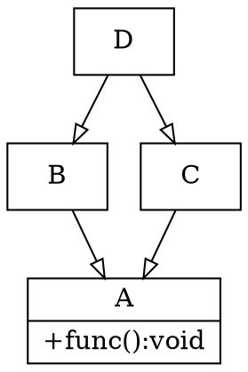

# Python 多重继承

## 基本操作

python 和 c++一样，也支持多重继承，通常用于组合多个属性。

假设有个电话的类Phone,有个照相机的类Camera，又有一个手机的类 MobiPhone，既有电话的功能、又有照相机的功能：

```python
class Phone:
    def call(self):
        print("Phone call ...")


class Camera:
    def take_photo(self):
        print("Camera take photo ...")


class MobiPhone(Phone, CAmera):
    ...
```

多重继承用于合并多个属性。

## 关于函数选择的问题

C++中的多重继承存在一个菱形继承的问题，表现如下：



B 和 C 继承自 A，A中有一个成员函数func，D 多重继承自B和C，那么，当D调用func的时候就会出现冲突（会调用B中A的func还是C中A的func？），C++需要使用虚拟继承来解决这个问题。

接下来看看 python 中如何表现。

```python
class A:
    def func(self):
        print("func")


class B(A):
    ...


class C(A):
    ...


class D(B,C):
    ...


t = D()
t.func()
```

程序输出：
```text
func
```

程序没有报错，这说明 python 不存在多重继承函数调用冲突的问题。

再看另一个例子：

```python
class A:
    def func(self):
        print("A func")


class B:
    def func(self):
        print("B func")


class C(A,B):
    ...


t = C()
t.func()
```

程序输出
```text
A func
```

也没有发生错误。python调用一个函数的时候，先从本类中找，然后从多重继承的类从左到右的顺序查找，所以不会出现冲突。

