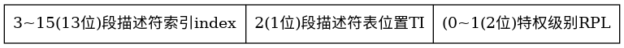
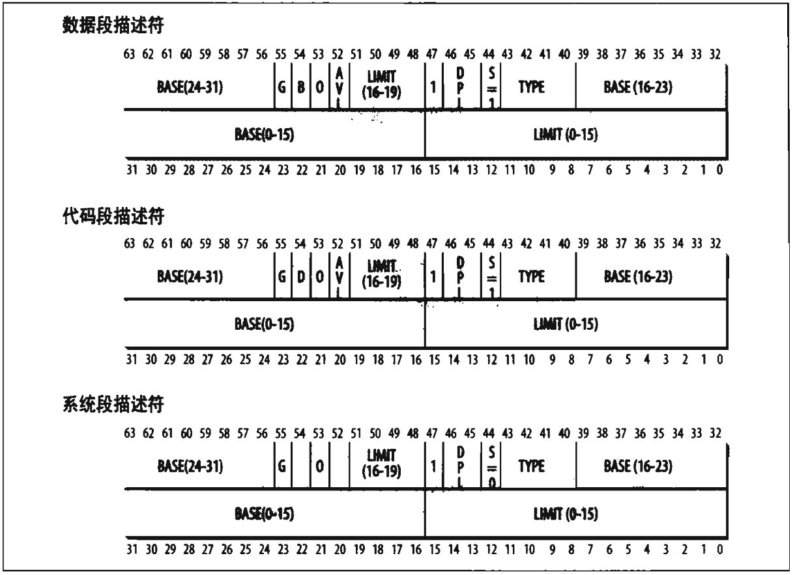
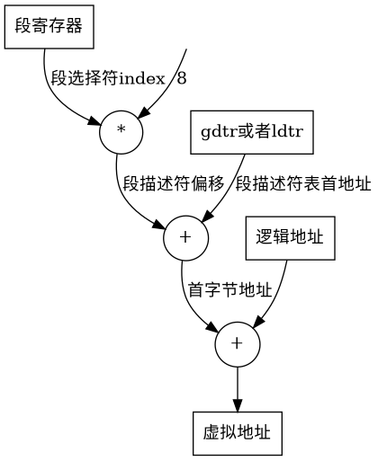
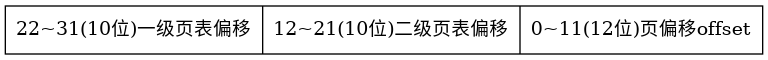
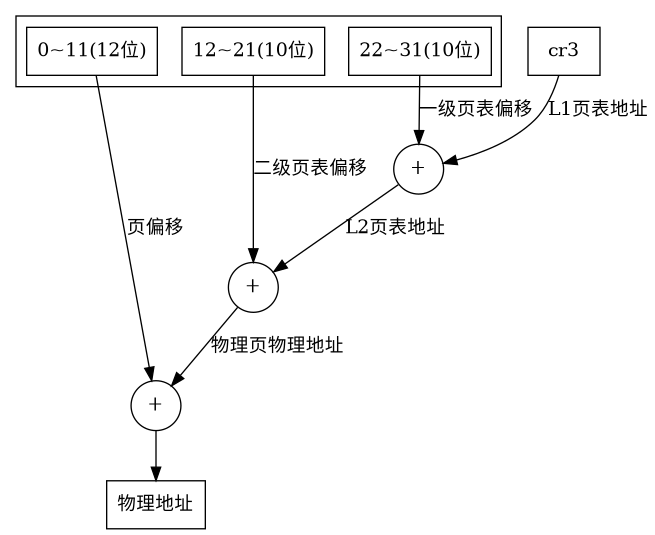
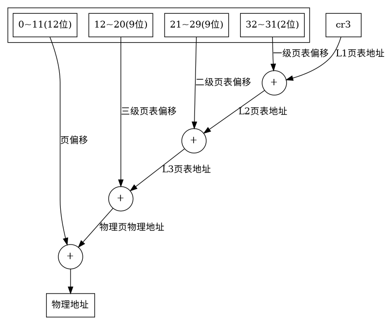

# 地址分类

当使用80x86处理器时，需要区分以下三种地址：

* 逻辑地址
    包含在机器语言指令中用来指定一个操作数或者一条指令的地址。每一个逻辑地址都由一个段选择符（16位）和一个偏移量（32位）组成。
* 虚拟地址（线性地址）
    32位无符号整数，用来表示4GB地址。
* 物理地址
    内存芯片的内存单元地址。物理地址使用32位或者36位（启用物理地址扩展PAE后）无符号整数表示。

分段单元和分页单元是内存控制单元MMU的硬件电路。

# 分段（逻辑地址到虚拟地址）

## 段寄存器

CPU提供了6个段寄存器：CS，SS，DS，ES，FS，GS，其中3个有专门用途：

* CS 代码段寄存器
* DS 数据段寄存器
* SS 栈段寄存器

## 段选择符

段寄存器中存储的数据就是段选择符，段选择符是个16位的数据，其中高13位称为段描述符索引，第14位表示段描述符表的位置（只有两个位置可选，后面会讲），第15～16位表示特权级（内核态还是用户态）

## 全局描述符表GDT和描述符符表LDT

这就是上面段选择符中第2位表示的位置TI，当这个值为0的时候，表示选择GDT，为1时表示选择LDT。

GDT通常只有一个，而每个进程除了GDT之外，如果需要创建附加的段，那就可以有自己的LDT。

CPU中有两个寄存器gdtr和ldtr分别存储了GDT与LDT的地址大小。

GDT与LDT的每个条目叫做段描述符。

## 段描述符

如下图（《深入理解Linux内核》）：

段描述符包含的信息比较复杂，并且不同的段描述符的字段含义有稍许差异。这里我们只需要关心与寻址相关的字段。

BASE字段包含了段的首字节地址。

## 翻译步骤

接下来描述一下一个完整的逻辑地址转换为虚拟地址的步骤。

1. 从段寄存器中存储的段选择符中读出TI，用此选择GDT还是LDT
2. 将段选择符中的index*8 （段描述符的大小是8字节，或者说段描述符是8字节对齐），获得了段描述符的偏移
3. 根据步骤1选择的gdtr或者ldtr读出段描述符表的首地址。
4. 将段描述符表的首地址与段描述符偏移相加，得到了所选的段描述符项，从中读出段首字节地址。
5. 将段首字节地址与逻辑地址相加得到虚拟地址。

在实际情况中，linux中段描述符中的首字节地址总是0，所以在linux下，逻辑地址与虚拟地址是等价的。

# 分页（虚拟地址到物理地址）

## 页与页框

虚拟地址被分为以固定长度为单位的组，被称为**页**。

分页单元将RAM分成固定长度的组，被称为**页框**（或者称为物理页）。

页与页框长度一致。

## 页表

页表相当于一个目录，这个目录将虚拟地址映射到物理地址。

页表也在内存中，所以在启用分页单元之前就必须由内核对页表进行适当的初始化。

分页单元的启用是通过cr0寄存器中PG标志控制的，当PG=1的时候，启用分页。

## 32位虚拟地址的常规分页

32位虚拟地址被分成3个部分：

1. 10位一级页表偏移L1（也称为页目录）
2. 10位二级页表偏移L2（也称为页表）
3. 12位页偏移offset（刚好能表示4KB）

为什么需要二级页表，而不是直接使用一级页表，用高20位表示页表便宜呢？如果只使用一级页表，那么页表项（PTE）就多达2^20个，每个占用4字节也需要4MB的RAM，而每个进程都有自己的页表，所以每个进程最小的内存都会是4M。如果使用二级页表，第二级页表会在需要时才分配，不需要一开始就分配所有第二级页表。

页表的每一项都是32位，其中有20位表示了一个物理地址（因为页是4KB对齐，所以20位可以表示一个页的位置）。剩下的12位是各种标记。

L1中的20位地址表示了L2在物理内存中的起始位置（说明每级页表最多只占1页），L2中的20位物理地址表示了需要寻址的物理页在物理内存的位置。

## cr3寄存器

上面说到虚拟地址的高10位是L1页表偏移，那么L1页表的位置在哪呢？寄存器cr3记录了L1页表在物理内存中的起始位置。

cr3是个进程上下文寄存器，在进程切换的时候，cr3也会同步切换到当前进程的L1页表地址。

## 翻译步骤

1. 从cr3寄存器取出L1页表地址
2. 根据虚拟地址的高10位计算出L1页表项
3. 取L1页表项中表示地址的20位*4K计算出L2页表地址
4. 根据虚拟地址的中间10位计算出L2页表项
5. 取出L2页表项中表示地址的20位*4K计算出物理页的物理地址
6. 将物理页的物理地址与虚拟地址中低12位的offset相加，得到最终的物理地址

## 扩展分页

从奔腾模型开始，80x86处理器引入了扩展分页，没有L2页表，也就是说，虚拟地址中有22位表示了页地址偏移offset，所以此时的一个页的大小就是2^22=4MB。扩展分页用于把大段的连续线性地址转换成物理地址。

扩展分页没有L2页表，所以更节省内存。

扩展分页开关位于L1页表的Page Size标志。

## 物理地址扩展（PAE）

常规分页从32位线性地址到32位物理地址，也就是说，只有4GB的物理内存可以被寻址到。如果机器上装有超过4GB的内存，那怎么办呢？这时候就需要PAE了。

PAE是让32位虚拟地址能够映射到36位（64GB）（处理器管脚已经增加到可以寻址64GB）物理地址的一种地址映射机制。

因为页大小还是4KB，所以虚拟地址中需要保存offset还是需要12位，这和常规分页一样，都是虚拟地址的低12位。

因为页表项有12位用来表示一些标记，还有24位高地址无法保存到原来的32位页表项中（页表项还剩20位了），所以需要扩大页表项，因为对齐的原因，将页表项扩展到64位，其中表示地址的有24位。

因为页表项从32位扩展到64位，所以页表的项数就从1024项变为512项（由于对齐的原因，页表需要放在一个页面中），因此，虚拟地址中只需要9位来表示页表项偏移。

32位虚拟地址 - 12位offset - 9位页表偏移 - 9位页表偏移 = 2位

offset和两级页表一共占去32位地址，还有2位怎么利用呢？再增加一级页表！

所以PAE就出现了3级页表，只不过第一级页表（也叫目录指针表）只有4项。

cr4中的PAE标志用来激活PAE。

## 翻译步骤

PAE分页寻址过程如下：

过程与常规分页类似，只不过物理地址由常规分页的32位扩展到36位。

## TLB加速

从上面的流程来看，页表存储在物理内存，所以每次进行地址翻译的时候还需要查询内存，这将花费几十到几百个时钟周期，如果需要的页表条目在高速缓存中，那么这个时间将降低到1到2个时钟周期，但是，系统对速度的需求是无止境的，所以它们在MMU中增加了一个高速缓存，被称为翻译后备缓冲器（TLB）。

TLB与高速缓存结构类似，对近期使用的页表项进行缓存，因为局部性原理，所以对TLB的命中还是非常高的。

TLB在cr3寄存器更新的时候失效，之后会重新缓存新的页表项。

## x86_64的内存寻址

x86_64和80x86处理器寻址方式类似，只是他有更多的页表级别，每种64位处理器对虚拟内存地址段的划分方式不一样，具体可以查阅相关的处理器文档。

# More
需要理解更多细节可阅读：

* 《深入理解计算机操作系统》 第9章 虚拟内存
* 《深入理解Linux内核》 第2章 内存寻址
