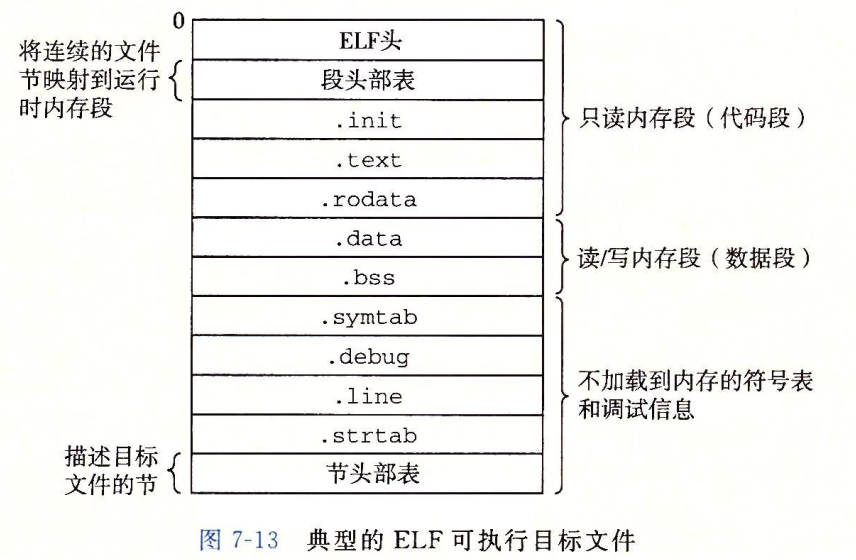
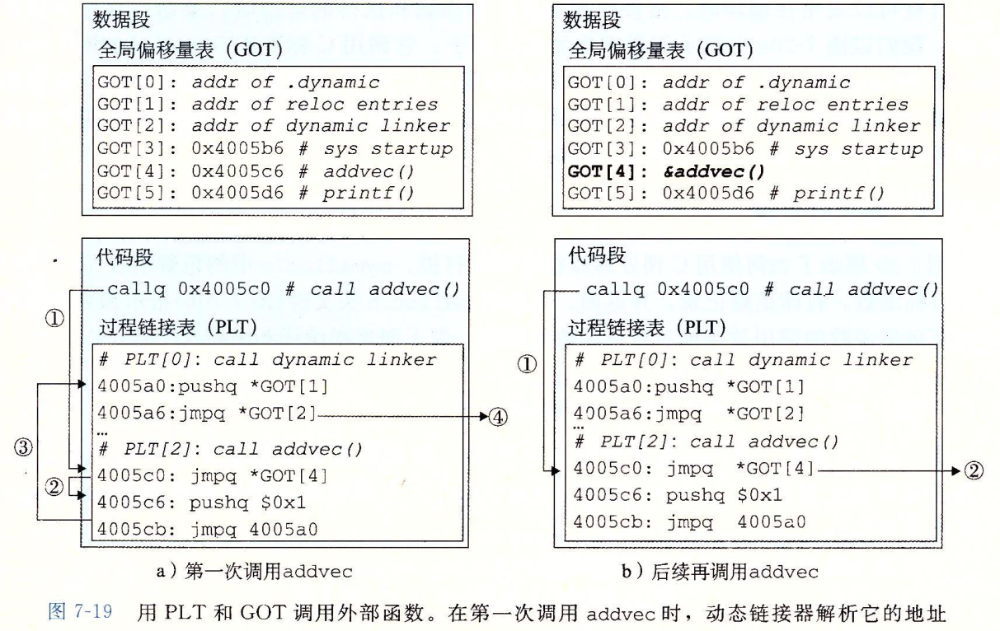

* 学习链接的必要性：
    1. 帮助你构建大型程序
    2. 避免一些危险的编程错误
    3. 理解语言的作用域规则是如何实现的
    4. 理解其他重要的系统概念
    5. 利用共享库
* 编译器执行步骤：
    1. cpp 预处理 main.c -> main.i
    2. ccl 翻译为汇编文件 main.i -> main.s
    3. as 翻译为可重定位目标文件 main.s -> main.o
    4. ld 链接 main.o -> main
* 链接器需要完成
    1. 符号解析
    2. 冲定位
* 目标文件分为三种：
    1. 可重定位目标文件： 静态库
    2. 可执行文件
    3. 共享目标文件： 动态库
* ELF： Executable and Linkable Format，可执行可链接格式
* ELF可重定位目标文件由三部分组成：
    1. ELF头部（描述了生成此文件的系统的字的大小以及字节顺序、ELF头大小、目标文件类型、机器类型、节头部表偏移等信息）
    2. 节
    3. 节头部表（描述节的信息）
* 一个典型的ELF可重定位目标文件包含以下几个节：
    1. .text 程序的机器代码
    2. .rodata 只读数据
    3. .data 初始化的全局和静态C变量
    4. .bss 未初始化的全局和静态C变量
    5. .symtab 符号表，存放程序中定义和引用的函数和全局变量，注意：没有局部变量信息。
    6. .rel.text .text节中位置的列表
    7. .rel.data .data节中位置的列表
    8. .debug 调试符号表，只有-g的时候才会产生
    9. .line c源程序的行号与.text节中机器指令的映射，只有-g的时候才会产生
    10. .strtab 字符串表
* 符号表包括：
    1. 由本模块定义的，可以被其他模块引用的符号：非静态的函数与全局变量。（导出符号）
    2. 其他模块定义的，本模块引用的符号。（导入符号）
    3. 本模块定义和引用的局部符号。static变量和函数
* 定义为带有static属性的本地变量不在栈中管理，编译器在.data或者.bss中为每个定义分配空间，并在符号表中创建一个有唯一名字的本地链接器符号。
* 在C语言中，任何不带static属性声明的全局变量和函数都是公共的，可以在其他模块中访问，而static属性声明的变量或者函数是私有的。尽可能使用static保护你的变量和函数是很好的编程习惯。
* .symtab节包含ELF符号表，符号表包含一个数组，描述了每个符号的属性。
* 可执行文件中节头部表中不包含以下三个伪节，这些节只在可重定位目标文件中存在：
    1. ABS：不该被重定位的符号
    2. UNDEF： 未定义的符号
    3. COMMON： 未分配位置的未初始化的数据目标。
* COMMON伪节与.bss节的区别：
    1. COMMON 未初始化的全局变量
    2. .bss 未初始化的静态变量，以及初始化为0的全局或静态变量。
* readelf 是查看目标文件内容的很方便的工具。
* 链接器解析符号引用的方法是将每个引用与它输入的可重定位目标文件的符号表中的一个确定的符号对应起来。
* 对于全局符号，如果编译器遇到一个不在本模块定义的符号时，会假设他在其他模块定义。
* C++和Java允许重载，是因为编译器将参数也编码为符号的一部分。
* 函数和已初始化的全局变量是强符号，未初始化的全局变量是弱符号。
* 多重定义符号名处理规则：
    1. 不允许重名的强符号
    2. 如果有一个强符号和多个弱符号，选择强符号。
    3. 如果没有强符号，有多个弱符号，就从弱符号中任意选择一个。
* GCC使用参数-fnocommon选项可以告诉链接器，如果遇到多重定义的全局符号的时候，就触发一个错误。
* 遇到一个未定义全的局符号x，编译器无法预测该使用其他模块多个x的定义的哪一个，所以就将x分配成COMMON，如果x初始化为0，那他是一个强符号，编译器将他分配到.bss。静态符号的构造是唯一的，所以编译器就直接分配给.data或者.bss。
* GCC参数-static告诉编译器驱动程序，应该生成一个完全链接的可执行文件，加载后无须进一步链接。
* 如果库之间存在依赖，如liba.a依赖libb.a，链接的时候，liba.a必须出现在libb.a之前，否则就会出现未定义错误。
* 对于静态库，链接器会从归档文件中挑选需要的目标文件进行链接。
* 重定位步骤：
    1. 重定位节和符号定义：链接器会将所有类型相同的节合并为同一类型的新的聚合节，并给新的聚合节运行时内存地址。
    2. 重定位节中的符号引用。链接器修改代码节中对每个符号的引用，使他们指向正确的运行时地址。这个步骤依赖于重定位条目这个数据结构。
* 编译器在遇到一个最终位置未知的符号时，会生成一个重定位条目，代码重定位条目在.rel.text节中，数据的重定位条目在.rel.data节中。
* 两种基本的重定位类型：
    1. R_X86_64_PC32：使用32位PC相对地址引用。
    2. R_X86_64_32：使用32位PC绝对地址引用。
    这两种类型支持小型代码模型（代码和数据总体大小不超过2G）
* ELF文件格式
  
* 加载器将可执行文件的代码和数据复制到内存，并跳转到程序的第一条指令或入口点执行程序。
* 代码段总是从0x400000处开始，后面是数据段。运行时堆在数据段之后，通过调用malloc向上增长。堆后面的区域是为共模块保留的。用户栈从最大的和服用户地址开始（2^48-1），向较小的内存地址增长。栈上的区域，从2^48开始，是为内核中的代码与数据保留的。
* 代码段与数据段是由间隙的。（对齐）
* 栈、共享库和堆运行地址每次运行都可能不一样（ASLR），但是他们的相对地址是不变的。
* 除了一些头部信息，加载器加载的过程中并没有任何从磁盘到内存的数据复制，只有发生缺页中断的时候，系统才会用页面调度机制将数据从磁盘加载到内存。
* 对于动态加载的程序，加载器会注意到可执行文件的.interp节，这个节中包含动态链接器的路径名，动态链接器本身就是一个共享目标文件，加载器会运行这个动态加载器，然后动态加载器会完成：
    1. 重定位其他共享库的代码和数据段。
    2. 重定位所有对共享库中符号的的引用。
    3. 将控制权交还给应用程序。
* dlfcn.h中定义了运行时加载共享库的接口：dlopen、dlsym、dlclose、dlerror
* GCC -fpic参数生成位置无关代码，共享库的编译必须总是使用该选项。（新版的gcc已经默认带了此选项）
* PIC的数据引用和函数调用通过GOT（全局偏移量表）和PLT（过程链接表）实现：
    * GOT和PLT的描述：
        1. GOT是一个数组，每个条目包含8个字节地址。GOT[0]和GOT[1]包含动态链接器在解析函数地址时会用到的信息，GOT[2]是动态链接器的入口地址。其余的每个条目对应一个被调用函数，初始的时候，每个GOT指向与之对应的PLT条目的第二条指令。
        2. PLT也是一个数组，每个条目是16字节代码。PLT[0]跳转到动态链接器，PLT[1]调用系统启动函数__libc_start_main。从PLT[2]开始的条目调用用户代码调用的函数。
    * 工作原理
    调用共享库中的函数addvec
    
    1. 程序调用进入PLT[2]（addvec函数对应的PLT条目）
    2. 通过GOT[4]（addvec对应的GOT条目）进行跳转，但是由于初始的时候，每个GOT指向与之对应的PLT条目的第二条指令，所以他直接会跳转到PLT的下一条指令。
    3. 把addvec的ID压入栈中，跳转到PLT[0]。
    4. PLT[0]的代码将GOT[1]的地址压入栈中，然后跳转到GOT[2]地址处，GOT[2]是动态链接器入口的地址，动态链接器使用两个栈条目（addvec的ID和GOT[1]）来确定addvec的运行时位置，用这个地址重写GOT[4]，此时GOT[4]就是addvec的运行时位置了。
    5. 然后将控制权交给addvec。
    6. 在后续调用中，跳转到GOT[4]实际就是跳转到了addvec了。
* [库打桩机制](/blog?blog=4)
* 处理目标文件的工具
    * ar 创建静态库，插入、删除、查找成员。
    * strings 列出一个目标文件中所有可打印的字符串。
    * strip 从目标文件中删除符号表信息。
    * nm 列出一个目标文件的符号表中定义的符号。
    * size 列出一个目标文件中节的名字和大小。
    * readelf 显示一个目标文件的完整结构
    * objdump 所有二进制工具之母。显示出目标文件中的所有信息。最大作用是反汇编。
    * ldd 列出一个可执行程序在运行时所需要的共享库。
