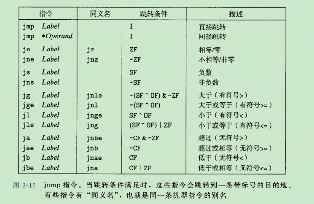
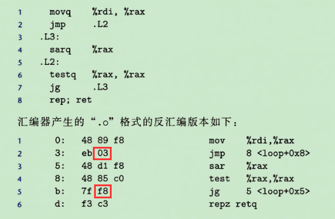
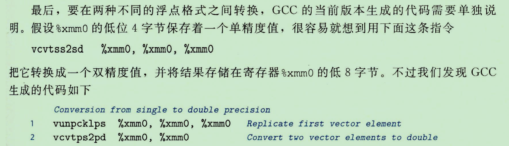
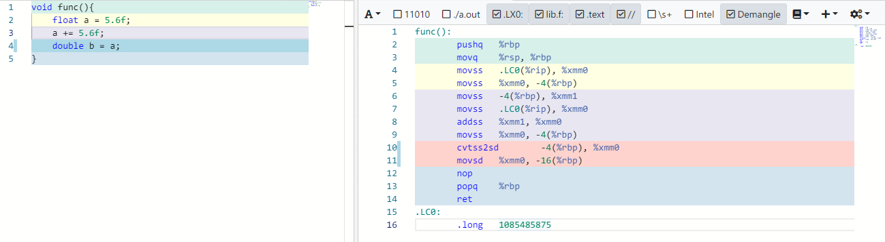

* 编译器将高级程序语言一步步转换为平台相关的机器级表示
* 高级语言代码生产效率高，并且便于移植。
* 学习机器代码（汇编代码）的意义：
    * 程序优化
    * 多线程编程中可以看到共享变量的准确引用位置
    * 安全漏洞
    * ...
* 学习机器代码的需求
    * 早期：开发汇编程序
    * 现在：阅读并理解编译器产生的代码
* gcc参数-Og表示生成符合原始C代码整体结构的机器代码和优化等级。
* 汇编代码中没有数据类型，数据类型只是辅助编译器做类型检查。
* 程序内存：1. 可执行的机器代码 2.操作系统信息 3.运行时栈 4.运行时堆
* 操作系统负责将虚拟地址与物理地址对应起来。
* 一条指令只执行一个非常基础的操作（算术、跳转、传送...）
* gcc使用-S可以看到汇编代码
* 反汇编器objdump，使用-d参数
* x86-64指令长度（1到15字节），经常使用的指令较短，不经常使用的指令较长。
* 指令设计方法是，在摸个位置，唯一的可以把字节序列解码为一个指令。
* 链接器填入实际的地址。
* 复制或生成数据时，对于1字节与2字节，寄存器的高位保持不变，对于4字节，高位置0
* 寻址方式

* 数据传送指令
    * mov（movb,movw,movl,movq,movabsq），movabsq可以使用64位立即数作为源操作数，目的操作数必须是寄存器，mov指令源操作数和目的操作数不能都是内存位置。
    * movz（movzbw，movzbl，movzwl，movzbq，movzwq），0扩展，高位置为0
    * movs（movsbw，movsbl，movswl，movsbq，movswq，cltq），符号扩展，eax符号位扩展到rax
* 压入弹出栈数据（push和pop）
* 局部变量通常保存在寄存器中，而不是内存中。
* leaq并不加载数据，而是计算地址存储到目的寄存器。
* 算术右移SAR（保留符号位）逻辑右移SHR（符号位置0），SAL和SHL一样。
* 128位命名为o，如ctlo
* 除法指令的被除数是rax，商存放在rax，余数在rdx。
* 条件码寄存器（flag寄存器）：CF 进位 ZF 零  SF 符号 OF 溢出
* leaq指令不修改条件码寄存器
* cmp与sub指令操作类似（cmp不设置目的寄存器的值），test与and指令类似（test不设置目的寄存器的值）
* 直接跳转使用一个标号作为跳转目标，比如`jmp .L1`，间接跳转需要一个‘*’表示，如：`jmp *%rax`表示使用rax中的值作为跳转目标。`jmp *(%rax)`表示rax的值为内存地址，从内存中读出跳转目标。
* 其他跳转指令：

* PC相对跳转，相对的是当前位置的下一条指令的地址。


这里的操作数为03，下一条指令地址为5，所以跳转到3+5=8的位置；下一个操作数为f8，即-8，下一条指令的地址为d，即13，所以跳转到13-8=5的位置。
* PC相对跳转的好处是链接的时候不需要修改跳转的目标地址，而且指令编码简洁。
* 条件控制实现条件分支，主要靠跳转指令。
* 条件传送实现条件分支，将两个结果都计算出来，然后判断条件赋值（判断条件赋值是一条指令）。其优势主要依赖于cpu的多级流水线。
* 条件传送无法编译会出现错误的代码。如：

```c
long cread(long *xp){
    return (xp?*xp:0);
}
```

使用条件传送会执行`*xp`，但是如果`xp`为`NULL`，就会出现错误，所以这段代码必须使用分支代码来编译。

* 条件数据传送提供了一种用条件控制转移来实现条件操作的替代策略，只能使用于非常受限制的情况，但是这种情况还是很常见的，并且能充分利用多级流水线。
* 循环的翻译
    * do-while
    ```c
    do
        body-statement
        while(test-expr);
    ```
    翻译为
    ```c
    loop: 
        body-statement
        t = test-expr;
        if(t)
            goto loop;
    ```
    * while循环
    ```c
    while(test-expr)
        body-statement
    ```
    有两种翻译方式
        
    1. 跳转到中间
        ```c
            goto test
        loop: 
            body-statement
        test:
            t = test-expr
            if(t)
                goto loop
        ```

    2. guarded-do

    ```c
    t = test-expr;
    if(!t)
        goto done;
    loop:
        body-statement
        t = test-expr
        if(t)
            goto loop;
    done:
    ```

    * for
    ```c
    for(init-expr; test-expr; update-expr)
        body-statement
    ```
    1. 跳转到中间
    ```c
        init-expr；
        goto test;
    loop:
        body-statement
        update-expr; 
    test:
        t = test-expr; 
        if(t)
            goto loop;
    ```
    2. guarded-do
    ```c
        init-expr; 
        t = test-expr; 
        if(!t)
            goto done;
    loop:
        body-statement
        update-expr;
        t = test-expr;
        if(t)
            goto loop;
    done:
    ```

* switch语句翻译时，当分支比较多并且值得跨度比较小的时候，会使用跳转表。
* 过程需要包含下面一个或几个机制
    * 传递控制
    * 传递数据
    * 分配和释放内存
* 当过程需要的存储空间超出寄存器能够存放的大小的时候，就会在栈上分配内存，这个部分被称为过程的栈帧。
* 大多数过程的栈帧都是定长的，在过程的开始就分配好了，但是有些过程需要变长的帧。
* 使用寄存器可以传递6个参数，如果参数个数超过6个的时候，调用者会在自己的栈帧中存储多余的的参数。（**注意：超过6个的参数存储位置是调用者的栈帧**）
* 很多函数并不需要栈帧。（局部变量都保存在寄存器中，并且不会调用其他函数）
* call指令将rip或者cs与rip压入栈中，然后jmp到指定位置
* ret指令从栈中恢复rip或者cs和rip。
* 使用6个寄存器传递参数：rdi,rsi,rdx,rcx,r8,r9
* 返回地址位于调用函数的栈帧中。
* 通过栈传递参数的时候，所有数据大小都必须向8的倍数对齐。（局部变量不必）
* 局部数据必须放在内存中的情况：
    * 寄存器不足以存放所有的本地数据
    * 对局部变量取址。（寄存器不能取址）
    * 数组或者结构
* rbp、rbx与r12到r15被划分为*被调用者*保存的寄存器，其他（如rsp等）被划分为*调用者*保存的寄存器。
* struct的字段选取完全是在编译期进行的。
* 结构体数据对齐
    * 每个元素按照自身大小的整数倍对齐
    * 整个结构体大小会按照结构体中最大的基础类型对齐
* 任何内存分配函数生成的块地址必须是16的倍数。
* **大多数**函数的栈帧边界都必须是16字节的倍数。
* 编译器应对缓冲区溢出的机制
    * 栈随机化
    * 栈破坏检测
    * 限制可执行代码区域
* 函数调用开始push rbp，并将rbp设置到rsp的位置，返回前使用leave指令，这条指令相当于将rsp设置为rbp，并将rbp出栈。
* SIMD指的是单指令多数据。
* MM寄存器64位，XMM寄存器128位，YMM寄存器256位。
* GCC给定参数-mavx2时，生成AVX2代码。
* 浮点数参数使用xmm寄存器传递，返回值也一样。
* 浮点寄存器之间传送数据使用对齐的指令movaps或者movapd，寄存器与内存之间传送使用movss或者movsd
* cvtsi2sdl指令与cvtsd2sil用于浮点数（双精度）与整数之间的转换
* 关于双精度浮点数转换为单精度浮点数，实际实验与书中不符合。
    * 书中
    
    * 实际测试
    
    实际上书中的第二个操作数只是为了保证目的操作数的高位不变，所以一般和目的操作数一致，可能精简为目的操作数，待验证。
* 所有的xmm寄存器都是调用者保存的。
* 浮点数在汇编中无法用立即数表示，编译器会为所有浮点数常量值分配内存空间。
* 浮点数和整形混用时，传参是分开的。