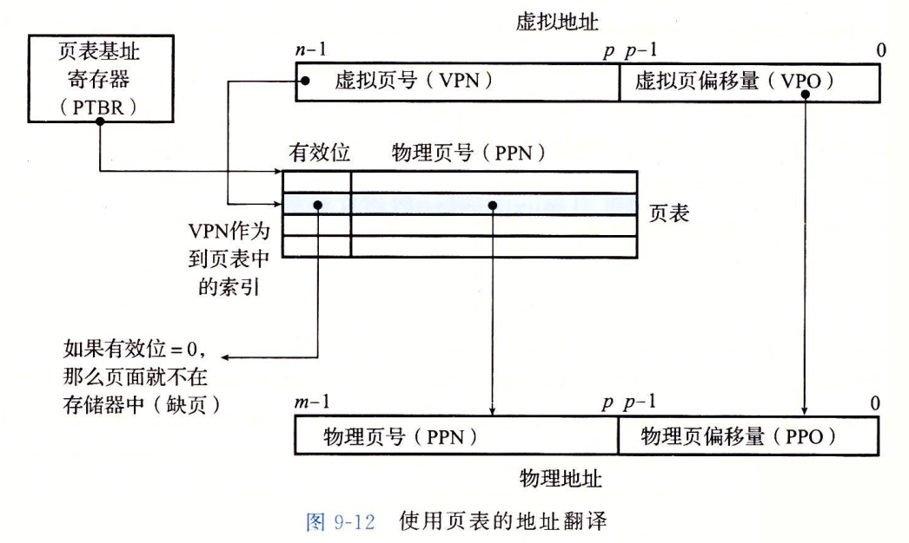
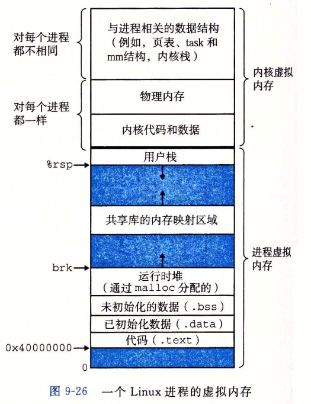

* 虚拟内存的作用：
    1. 高效利用内存
    2. 简化内存管理
    3. 保护进程地址空间
* 早期处理器使用物理寻址，现代处理器使用虚拟寻址。
* cpu将虚拟地址传送给MMU，MMU将虚拟地址翻译为物理地址。
* 虚拟地址空间：cpu从0到N=2^n范围内生成虚拟地址，那么这个地址空间叫做n位虚拟地址空间。
* 物理地址空间：内存对应的M个字节，M不要求是2的幂。
* 虚拟内存被分割为虚拟页，物理地址被分割成物理页，物理页也被称为页帧。
* 任意时刻，虚拟页面集合都分为3个不相交的子集：
    1. 未分配的
    2. 缓存的
    3. 未缓存的
* DRAM是全相连的：只有一个缓存组。
* 因为磁盘访问时间比较长，所以DRAM总是使用写回，而不是只写。
* 页表是一个由PTE（页表条目）组成的数组（类似高速缓存行除去数据块的部分，数据块被替换为磁盘地址）。
* 虚拟内存在磁盘存储，当进程发生缺页异常时，内核会将虚拟内存中的数据复制到物理内存（此过程类似高速缓存）。
* 内存与磁盘之间传送页的活动叫做交换或者页面调度。页从磁盘换入内存，从内存换出到磁盘。
* 虚拟内存不命中的处罚很大，但是由于局部性，虚拟内存工作的很好。
* 如果工作集的大小超过了物理内存的大小，那么程序会发生“抖动”，这时页面将不断地换进换出。
* 可以利用linux命令geteusage检测缺页数量。
* 操作系统会为每个进程创建也给单独的页表，也就是一个独立的地址空间。
* 多个虚拟页面可以映射到同一个共享物理页面上。
* 虚拟内存简化了链接、加载、代码和数据共享，以及程序的内存分配。
* 当程序请求一个连续的内存空间时，实际分配了一个连续的虚拟内存页面，并且将他们映射到物理内存中任意n个位置的物理页面，由于页表的工作方式，操作系统没有必要分配n个连续的物理内存页面。
* 通过给PTE上添加一些额外的许可位来控制对一个虚拟页面的内存的访问。如果一个访问违反了这些许可条件，就会触发一个一般保护故障，将控制传递给一个内核中的异常处理程序。（段错误）
* MMU利用页表实现虚拟地址与物理地址之间的映射：
  
* 页表基址寄存器会随着进程切换而改变。
* 高速缓存的查询应该使用物理内存地址，这样对于权限的检查就可以完全由地址翻译过程进行。
* TLB是一个虚拟寻址的缓存，用于缓存页表中的条目。这样可以省去查询L1的时间。
* 通常使用多级页表完成地址翻译。（虚拟地址高位分别为多级页表的索引），对于一个k级页表，每次寻址，都要查询k次页表，但是由于TLB的存在，这个过程并不会慢太多。
* CR3寄存器存放了第一级页表的位置。CR3的值是每个进程的进程上下文，每个进程切换的时候会替换CR3的值。
* 页面的权限位在PTE上。
* PTE中还有一些标志位，比如脏位、引用位。
* 除过最后一级页表，其他页表中都有一个字段指向下一级页表的位置（物理页号），这个位置占用40位，这就要求页表开始必须以4KB对齐（这个字段是从第12bit开始的的）。最后一级页表这个字段指向子页物理基地址高40位，这要求物理页4KB对齐。
* 一个linux进程的虚拟内存：
    
* linux进程mm结构中的mmap链表保存了每个段的位置，大小，权限等信息，pgd保存了L1（一级页表）基址。
* 缺页的情况：
    1. 段错误：访问一个不存在的页，程序会中断执行，转入异常处理函数。
    2. 正常缺页：以正确权限访问存在的虚拟内存，但是所访问的虚拟内存不在物理内存中，会发生缺页中断（其实是个故障），内核会使用页面调度算法将请求的页面换入物理内存，然后重新执行引起异常的指令。
    3. 保护异常：访问的虚拟内存存在，但是使用的权限不正确。此时程序会中断执行，转入异常处理函数。
* linux通过将虚拟内存区域与一个磁盘上的对象关联起来，以初始化这块虚拟内存的内容，这个过程叫做内存映射。
* 虚拟内存文件可以映射到下面两种文件中的一种:
    1. 文件系统中的普通文件
    2. 匿名文件
* 无论使用上面哪种文件，一旦一个虚拟页面初始化了，他就在一个由内核维护的专门的交换文件之间。
* 交换空间限制着当前进程能够分配的虚拟页面总数。
* 一个对象可以被映射到虚拟内存的一个区域，要么作为一个共享对象，要么作为一个私有对象。
    1. 共享对象可以由多个进程共同写入和读取，一个进程修改了共享对象，其他进程可以查看。
    2. 私有对象。写时复制。初始状态的时候，只有一个对象存在于虚拟内存，当一个进程修改时，在本进程会复制一份该对象的部分副本（修改的那部分），这样看起来，每个进程就像都有一个相同的对象。
* fork复制父进程的数据时，就是私有写时复制。
* execve加载程序时，需要完成以下几个步骤：
    1. 删除已存在的用户区域
    2. 映射私有区域
    3. 映射共享区域
    4. 设置程序计数器PC
* mmap和munmap等函数提供手动映射虚拟内存的功能。
* 内核维护一个brk变量，指向堆的顶部，使用sbrk系统调用可以修改堆的大小。
* 堆内存双字对齐。
* 动态分配器的目标：
    1. 处理任意请求队列
    2. 立即响应请求
    3. 对齐块
    4. 不修改已修改的块
    
    在上面这些条件下，要尽可能实现：
    1. 最大化吞吐率
    2. 最大化内存利用率
* 内存碎片是指系统中还有未使用的内存，但是不能用来完成分配请求，分为以下两种：
    1. 内部碎片：已分配的块比有效内存大
    2. 外部碎片：当前空闲内存之和加起来满足一个分配请求，但是任意一个内存块都无法满足。
* 一个分配器需要在吞吐率和利用率之间把握好平衡，需要考虑以下问题：
    1. 空闲块组织
    2. 放置（选择）
    3. 分割
    4. 合并
* 隐式空闲链表：直接将堆上的空闲区域生成一个链表（链表直接在堆空间）
* 显式空闲链表：在堆外部建立一个链表，记录堆空闲块的地址。
* 分离的空闲链表：将空闲块分割成不同大小的内存块，分别组织在不同的链表中，有以下几种方案：
    1. 简单分离存储： 不分割不合并，分配就从链表中取，释放就归还给链表。
    2. 分离适配：分割大块，将剩余的内存块插入到更小的链表中。释放时执行合并，并放置到更大的链表中。
    3. 伙伴系统：特殊的分离适配。分配时将空闲区域递归2分割，合并时递归2合并。
* 选择空闲块的方法：
    1. 首次选择：每次都从开头查找第一个满足要求的块。
    2. 下一次选择：从上一次查找过的位置继续查找。
* 合并：使用边界标记
* C程序中常见的内存错误：
    1. 野指针
    2. 读取未初始化的内存
    3. 栈缓冲溢出
    4. 错位错误（溢出的一种）
    5. 错误地操作指针（本来是要操作它指向的对象）
    6. 引用不存在的对象
    7. 引用已释放内存
    8. 内存泄漏
