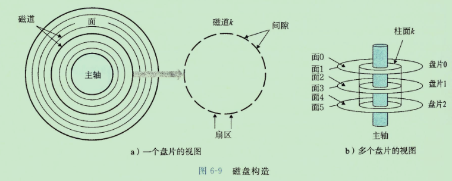

* 在简单模型下，存储是一个线性字节数组。但是他没有反映现代系统的实际工作方式。
* 随机访问存储器分为静态存储器和动态存储器，静态RAM更快，一般用作高速缓存，动态存储器用作主存。
* DRAM是由一个存储阵列组成，每个元素称为一个“超单元”。
* 读取DRAM时，行地址和列地址是分开发送的，共用地址引脚。
* 要读出一个超单元的内容，内存控制器先发送行地址，SRAM将整行内容复制到内部行缓冲区，再发送列地址，DRAM将行缓冲区对应列的内容复制到内存控制器。
* DRAM组织成二维阵列而不是先行数组的原因是降低引脚数量。缺点是行列地址分开发送，增加了访问时间。
* DRAM的每个64位字存储在不同的超单元中，每个一个字节，这些超单元接收一样的地址，返回一个字节，然后合成64位字，返回给内存控制器。
* 增强的DRAM
    * 快页模式（FPM DRAM）：复用行地址，后面直接发送列地址从行缓冲中获取数据。
    * 扩展数据输出（EDO DRAM）：在快页模式基础上，允许CAS信号在时间上更紧密一些。
    * 同步DRAM（SDRAM）：利用时钟上升沿代替控制信号，更快输出。
    * 双倍数据速率同步（DDR SDRAM）：通过使用两个时钟沿作为控制信号，使DRAM速度翻倍。
    * 视频RAM（VRAM）：用在图形帧缓冲中，与FPM DRAM类似，区别是：1. 输出是通过移位得到的 2. 允许并行读写
* PROM（可编程ROM）只能被编程一次，内部使用“熔丝”。
* EPROM（可擦写可编程ROM）使用紫外线擦除，擦除次数达到1000次。
* EEPROM（电子可擦除PROM），直接在印制电路卡上编程，可编程次数达到100000次。
* FLASH（闪存）基于EEPROM。
* 存储在ROM中的程序被称为固件（firmware）。
* 系统使用总线访问主存。
* CPU -- 系统总线 --> I/O桥 -- 内存总线 --> 主存
* 磁盘读取信息时间为毫秒级，比内存DRAM读慢了10万倍，比高速缓存SRAM读慢了100万倍。
* 磁盘扇区之间有间隙，用来存储扇区的格式化位。

* 最初的磁盘，每个磁道上的扇区数数量一致，这就导致了越往外的磁道利用率越低。现代大容量磁盘使用分区记录技术，这种技术将柱面分割成不相交的子集合，称为记录区，每个区包含一组连续柱面，每个区中每个柱面中每条磁道有相同数量的扇区数。
* 对扇区访问时间有三个主要组成部分：寻道时间、旋转时间、传送时间。
* 内存控制器维护逻辑块与物理扇区的映射关系。
* 格式化：标识出坏扇区、预留柱面备用。
* 读磁盘的过程
    1. cpu发送读命令，包含其他控制信息
    2. cpu发送逻辑地址
    3. cpu发送物理地址
    4. cpu继续处理其他内容
    5. 磁盘控制器将数据从磁盘拷贝到内存，过程不需要cpu参与（DMA）
    6. 磁盘控制器向cpu发出一个中断，表示读取完成。
    7. cpu暂停当前的工作，响应中断（记录一下I/O已完成）
    8. 继续执行被暂停的工作
* SSD使用闪存芯片代替了HDD的机械驱动器。
* 闪存翻译层替代磁盘控制器。
* SSD随机写比较慢，原因是：
    1. 擦除块需要很长时间
    2. 如果要写的块已经有有效页了，那这个块必需先被复制到另一个空闲块。
* 增加密度比降低访问时间容易得多。
* 局部性原理：程序倾向于引用临近于他最近用用过的数据项，或者直接引用引用过的数据项本身。
* 局部性分为时间局部性和空间局部性。
* 评价程序中局部性的原则：
    1. 重复引用相同变量的程序拥有良好的时间局部性。
    2. 对于具有步长为k的引用模式的程序，步长越小，空间局部性越好。
    3. 对于取指令来说，循环有好的时间和空间局部性。
* 缓存层次行之有效的原因：
    1. 利用时间局部性
    2. 利用空间局部性
* TLB由MMU管理。
* 高速缓存是一个高速缓存组的数组。每个组包含一个或多个行，每行包含一个有效位，一些标志位以及一个数据块。
* 每组只有一行的高速缓存被称为直接映射高速缓存。
* 每个组保存多于一个高速缓存行，被称为组相连高速缓存。
* 只有一个组的高速缓存被称为全相连高速缓存。
* 为什么用中间的位来做索引。
    如果使用高位做索引，那么一些连续的块就会被映射到相同的高速缓存块，会持续发生冲突型不命中。
* 衡量高速缓存性能的指标：
    1. 不命中率
    2. 命中率
    3. 命中时间
    4. 不命中处罚
* 较大的高速缓存增加了命中时间，这就解释了为什么L1、L2、L3都是SRAM，读写速度相当，为何还需要多级高速缓存。
* 编写高速缓存友好的代码：
    1. 让常见的情况运行得更快
    2. 尽量减小每个循环内部的缓存不命中数量。
* 对局部变量的反复引用是好的。
* 步长为1的引用模式是好的。
* 将注意力集中在内循环上，大多数的计算和内存访问都发生在这里。
* 通过按照数据对象在内存中的顺序、以步长为1来读取数据，从而使你的程序控件局部性最大。
* 一旦存储器读入了某个数据，就尽可能多次使用它，从而使时间局部性最大。