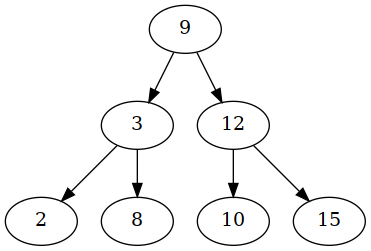
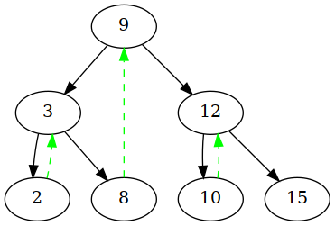
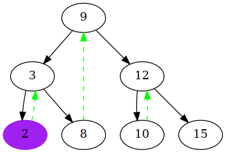
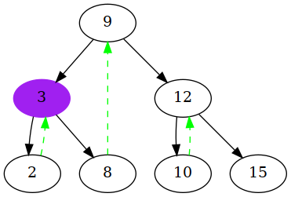
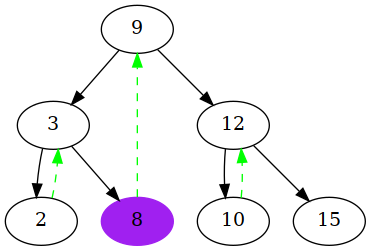
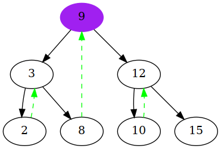
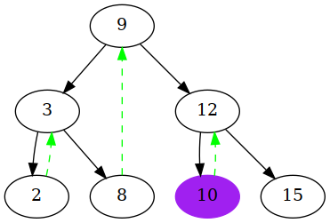
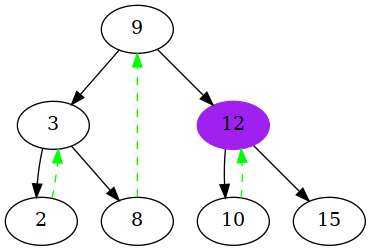
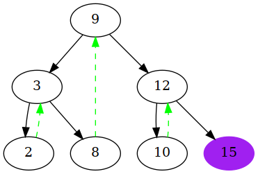

# 线索二叉树

线索二叉树可以让二叉树在不使用递归和栈的方法下遍历二叉树。

## 基本原理

这是一棵普通的二叉树：



如果我们需要不使用递归或者栈遍历这棵二叉树，需要知道访问到一个叶子节点后，下一个访问哪个节点，如下：



我们姑且称绿色的线段为next指针。当向左遍历到叶子节点后，next会指引我们接下来要访问哪个节点。

## 遍历方法

遍历方法如下：

1. 使用迭代方法找到子数最左侧节点，获取，设置当前节点为做左侧节点（**注意：在找的过程中不获取值**）
2. 根据next指针找到下一个节点，获取，设置当前节点为next指向的节点
3. 如果右子节点不为空，当前节点设置到当前节点的右子节点。
4. 重复上述过程

对于上述的二叉树，遍历步骤如下：

1. 根据9->3->2找到最左侧节点为2，输出2
   

2. 根据next找到3，输出3

    
   
3. 获取3的右子节点8，获取子树8的最左侧节点，是其本身8，输出8

    

4. 根据8的next找到节点9，输出9

    

5. 获取9的右子节点12，获取12的最左侧节点10，输出10

    

6. 根据10的next节点找到节点12，输出12

    

7. 获取10的右子节点15，获取15的最左侧节点15，输出15

    

8. 15的next为空，遍历结束。

示例代码如下：

```cpp
struct Node{
    int value;      // 为了方便，假设节点类型是int
    Node *left;
    Node *right;
    Node *next;
};


void Traversing(Node *head){
    Node * curr = head;
    auto leftMost = [](Node *p){
        while(p->left)
            p=p->left;
        return p;
    };
    curr = leftMost(curr);
    while(curr){
        // 遍历节点curr
        printf("%d\n", curr->value);
        //////////////
        if(curr->next){
            curr=curr->next;
        }else if(curr->right){
            curr=leftMost(curr->right);
        }else{
            break;
        }
    }
}


```